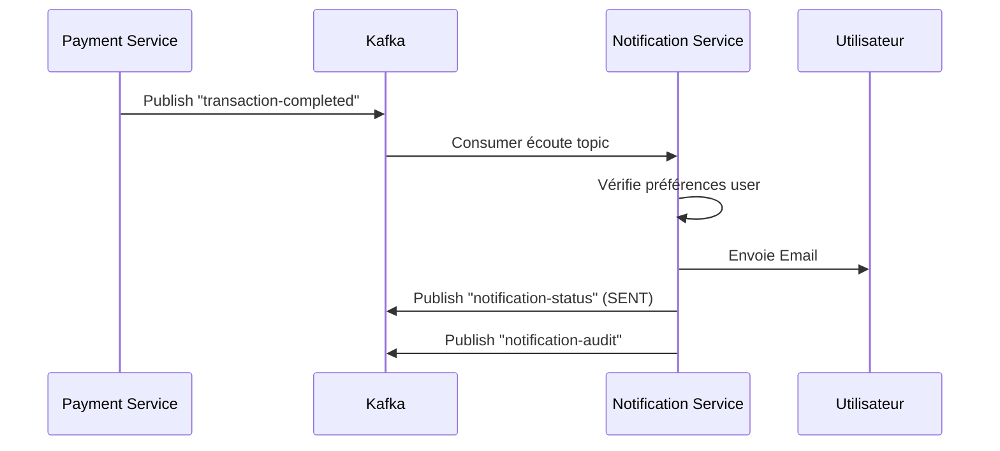

# Notification Service - Topics Kafka

## 🎯 Rôle du Service

Le **Notification Service** est à la fois **CONSUMER** et **PRODUCER** dans l'architecture Kafka:

### 📥 CONSUMER (Topics entrants)
Écoute les événements des autres microservices pour envoyer des notifications

### 📤 PRODUCER (Topics sortants)
Publie les statuts et résultats d'envoi de notifications

---

## 📥 Topics CONSUMER (Entrée)

### 1. `transaction.completed`
**Source**: `payment-service` / `account-service`  
**Déclencheur**: Transaction bancaire terminée  
**Action**: Envoie email de confirmation

**Format message**:
```json
{
  "userId": "user123",
  "userEmail": "user@example.com",
  "userName": "John Doe",
  "transactionId": "txn_abc123",
  "amount": 150.0,
  "currency": "EUR",
  "date": "2024-12-16T10:30:00",
  "type": "TRANSFER"
}
```

---

### 2. `payment.completed`
**Source**: `payment-service`  
**Déclencheur**: Paiement (virement, prélèvement) terminé  
**Action**: Envoie notification multi-canal (email + SMS selon montant)

**Format message**:
```json
{
  "userId": "user456",
  "userEmail": "user@example.com",
  "userPhone": "+33612345678",
  "paymentId": "pay_xyz789",
  "amount": 250.0,
  "recipient": "COMPANY XYZ",
  "status": "COMPLETED",
  "date": "2024-12-16T11:00:00"
}
```

---

### 3. `auth.events`
**Source**: `auth-service`  
**Déclencheur**: Événements d'authentification (login, MFA, etc.)  
**Action**: Alertes de sécurité

**Sous-types**:
- `LOGIN_SUCCESS`: Connexion réussie (email informatif)
- `LOGIN_FAILED`: Tentative échouée (alerte sécurité)
- `MFA_REQUIRED`: Demande 2FA (SMS avec code)
- `PASSWORD_RESET`: Réinitialisation mot de passe (email + lien)
- `NEW_DEVICE`: Connexion depuis nouvel appareil (alerte)

**Format message**:
```json
{
  "eventType": "LOGIN_SUCCESS",
  "userId": "user789",
  "userEmail": "user@example.com",
  "ip": "192.168.1.1",
  "device": "Chrome/Windows",
  "location": "Paris, France",
  "timestamp": "2024-12-16T12:00:00"
}
```

---

### 4. `fraud.detected`
**Source**: `payment-service` / `analytics-service`  
**Déclencheur**: Détection d'activité suspecte  
**Action**: Alerte urgente multi-canal (Email + SMS + Push + In-App)

**Format message**:
```json
{
  "userId": "user101",
  "alertType": "SUSPICIOUS_TRANSACTION",
  "severity": "HIGH",
  "details": "Transaction inhabituelle détectée",
  "transactionId": "txn_suspect_123",
  "amount": 5000.0,
  "timestamp": "2024-12-16T13:00:00",
  "actionRequired": true
}
```

---

### 5. `account.created`
**Source**: `account-service`  
**Déclencheur**: Nouveau compte créé  
**Action**: Email de bienvenue

**Compatibilité**: ✅ Compatible avec account-service

**Format message**:
```json
{
  "accountId": "uuid",
  "userId": "user202",
  "accountNumber": "string",
  "userEmail": "newuser@example.com",
  "userName": "Jane Smith",
  "accountType": "SAVINGS",
  "currency": "EUR",
  "balance": 0.00,
  "status": "ACTIVE",
  "createdAt": "2024-12-16T14:00:00Z"
}
```

---

### 6. `kyc.status.changed`
**Source**: `user-service`  
**Déclencheur**: Changement statut KYC (Know Your Customer)  
**Action**: Notification du statut (approuvé, rejeté, en attente)

**Format message**:
```json
{
  "userId": "user303",
  "userEmail": "user@example.com",
  "userName": "John Doe",
  "previousStatus": "PENDING",
  "newStatus": "APPROVED",
  "reason": "Documents validés",
  "timestamp": "2024-12-16T15:00:00"
}
```

---

### 7. `crypto.transaction`
**Source**: `crypto-service`  
**Déclencheur**: Transaction crypto (achat/vente)  
**Action**: Notification avec détails crypto

**Format message**:
```json
{
  "userId": "user404",
  "userEmail": "crypto@example.com",
  "userName": "Crypto Trader",
  "transactionType": "BUY",
  "cryptocurrency": "BTC",
  "amount": 0.05,
  "fiatAmount": 1500.0,
  "fiatCurrency": "EUR",
  "rate": 30000.0,
  "timestamp": "2024-12-16T16:00:00"
}
```

---

### 8. `notification.requested`
**Source**: N'importe quel service  
**Déclencheur**: Demande générique de notification  
**Action**: Envoi selon les paramètres fournis

**Format message**:
```json
{
  "eventType": "NOTIFICATION_REQUESTED",
  "eventId": "evt_123",
  "timestamp": "2024-12-16T17:00:00",
  "sourceService": "payment-service",
  "notificationData": {
    "userId": "user505",
    "recipient": "user@example.com",
    "type": "EMAIL",
    "subject": "Sujet personnalisé",
    "message": "Contenu du message",
    "priority": "HIGH"
  }
}
```

---

## 📤 Topics PRODUCER (Sortie)

### 1. `notification.status`
**Consommateurs**: `analytics-service`, `audit-service`, services sources  
**Contenu**: Statut d'envoi des notifications

**Sous-types d'événements**:
- `NOTIFICATION_SENT`: Notification envoyée avec succès
- `NOTIFICATION_FAILED`: Échec d'envoi
- `NOTIFICATION_DELIVERED`: Confirmation de livraison (email ouvert, SMS délivré)
- `NOTIFICATION_READ`: Notification lue (In-App)

**Format message**:
```json
{
  "eventType": "NOTIFICATION_SENT",
  "eventId": "evt_abc123",
  "timestamp": "2024-12-16T18:00:00",
  "sourceService": "notification-service",
  "result": {
    "notificationId": 12345,
    "status": "SENT",
    "provider": "EMAIL",
    "sentAt": "2024-12-16T18:00:05"
  }
}
```

**Exemple FAILED**:
```json
{
  "eventType": "NOTIFICATION_FAILED",
  "eventId": "evt_xyz789",
  "timestamp": "2024-12-16T18:05:00",
  "sourceService": "notification-service",
  "result": {
    "notificationId": 12346,
    "status": "FAILED",
    "errorMessage": "SMTP connection timeout",
    "provider": "EMAIL"
  }
}
```

---

### 2. `notification.audit`
**Consommateurs**: `audit-service`, `analytics-service`  
**Contenu**: Événements d'audit pour traçabilité complète

**Format message**:
```json
{
  "eventType": "NOTIFICATION_SENT",
  "eventId": "audit_001",
  "timestamp": "2024-12-16T19:00:00",
  "sourceService": "notification-service",
  "notificationData": {
    "userId": "user606",
    "message": "Email sent to user@example.com"
  }
}
```

---

### 3. `notification.metrics`
**Consommateurs**: `analytics-service`, Prometheus scraper  
**Contenu**: Métriques agrégées pour dashboards

**Format message**:
```json
{
  "timestamp": "2024-12-16T20:00:00",
  "metrics": {
    "totalSent": 1523,
    "emailsSent": 890,
    "smsSent": 423,
    "pushSent": 210,
    "failures": 15,
    "avgDeliveryTime": "2.3s"
  }
}
```

---

## 🔄 Flux Complet (Exemple Transaction)



---

## ⚙️ Configuration Kafka

### Consumer
```yaml
spring:
  kafka:
    consumer:
      group-id: notification-service
      auto-offset-reset: earliest
      enable-auto-commit: true
      concurrency: 3  # 3 consumers parallèles
```

### Producer
```yaml
spring:
  kafka:
    producer:
      acks: all  # Garantie forte
      retries: 3
      enable-idempotence: true
      compression-type: snappy
```

---

## 📊 Monitoring

### Métriques Prometheus

- `kafka.events.consumed{service="notification"}` - Événements Kafka consommés
- `notification.sent{type=email|sms|push}` - Notifications envoyées par type
- `notification.failed{type=email|sms}` - Échecs par type
- `notification.duration` - Temps d'envoi moyen

### Health Check

```bash
curl http://localhost:8084/actuator/health
```

---

## 🧪 Tests

### Publier un événement de test

```bash
# Transaction complétée
kafka-console-producer --broker-list localhost:9092 --topic transaction-completed
>{
  "userId": "test123",
  "userEmail": "test@example.com",
  "transactionId": "txn_test",
  "amount": 100.0,
  "date": "2024-12-16T10:00:00"
}
```

### Consommer les événements de statut

```bash
kafka-console-consumer --bootstrap-server localhost:9092 \
  --topic notification-status \
  --from-beginning
```

---

## 🔐 Sécurité

- ✅ Idempotence activée (évite duplications)
- ✅ Acks = all (garantie livraison)
- ✅ Retries automatiques (3 tentatives)
- ✅ Données sensibles non loggées
- ✅ SSL/TLS ready pour production

---

## 📚 Documentation

- [Architecture globale](../docs/architecture.md)
- [API REST](./K8S_README.md#api-endpoints)
- [Configuration](./src/main/resources/application.yml)
