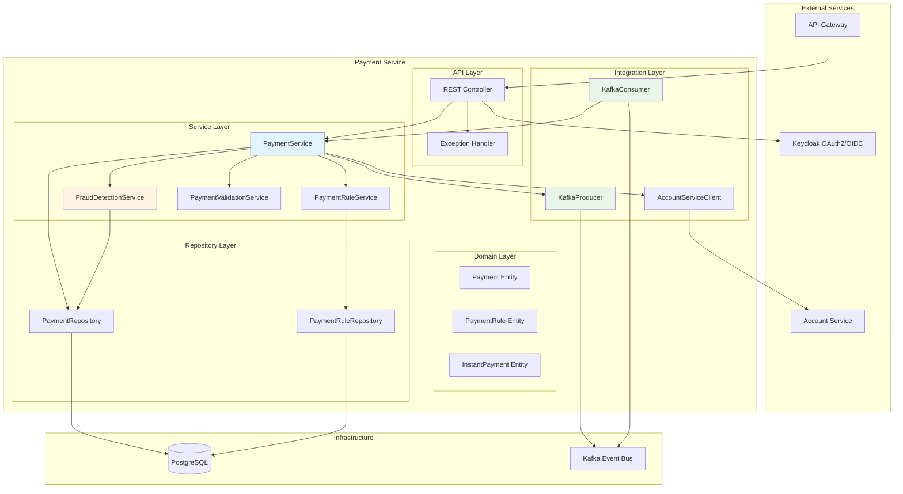
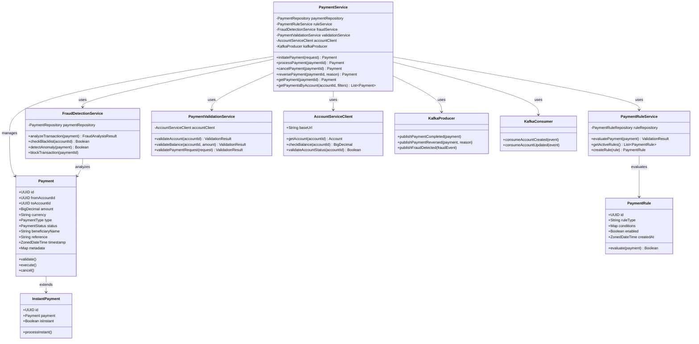
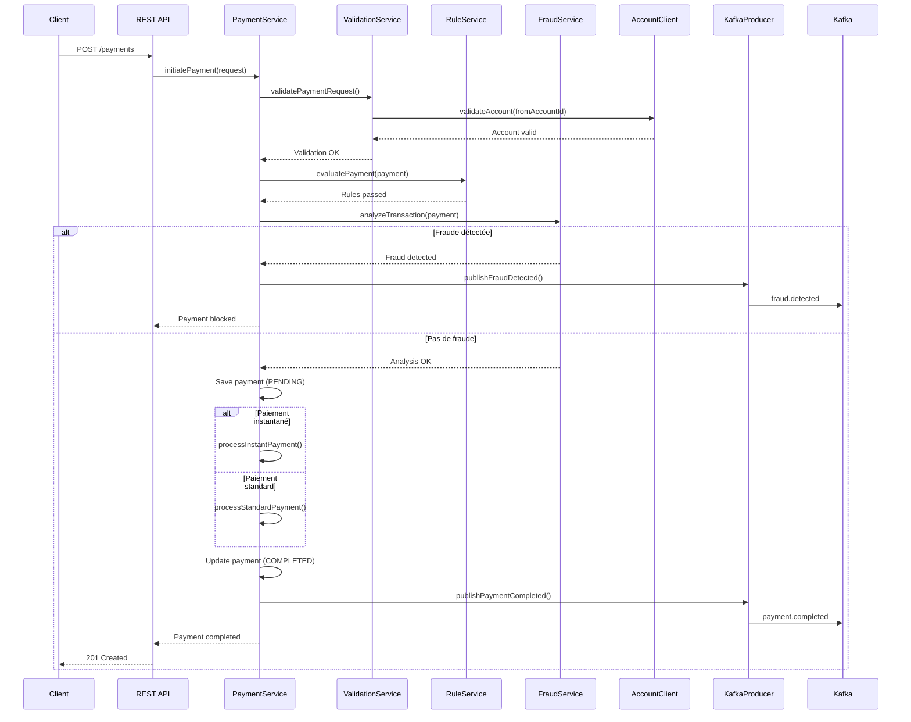

# Architecture - Payment Service

## Vue d'ensemble

Le Payment Service est responsable de la gestion des paiements et virements bancaires. Il gère le cycle de vie complet des paiements, de l'initiation à la complétion, incluant la détection de fraude et l'application de règles métier.

## Diagramme d'architecture



## Diagramme de classe détaillé



## Flux de traitement d'un paiement



## Topics Kafka

### Producer Topics

1. **payment.completed**
   - Publié quand un paiement est complété avec succès
   - Consommé par: Account Service, Notification Service

2. **payment.reversed**
   - Publié quand un paiement est annulé/reversé
   - Consommé par: Account Service

3. **fraud.detected**
   - Publié quand une fraude est détectée
   - Consommé par: Notification Service

### Consumer Topics

1. **account.created**
   - Consommé pour maintenir un cache local des comptes valides

2. **account.updated**
   - Consommé pour bloquer les paiements si compte suspendu/inactif

## Technologies

- **Language**: Java (Spring Boot)
- **Database**: PostgreSQL
- **Messaging**: Apache Kafka
- **Authentication**: Keycloak (OAuth2/OIDC)
- **API**: REST API
- **Containerization**: Docker
- **Orchestration**: Kubernetes

## Structure de données

### Payment Entity

```sql
CREATE TABLE payments (
    id UUID PRIMARY KEY,
    from_account_id UUID NOT NULL,
    to_account_id UUID,
    amount DECIMAL(19,2) NOT NULL,
    currency VARCHAR(3) NOT NULL,
    payment_type VARCHAR(20) NOT NULL, -- STANDARD, INSTANT, RECURRING
    status VARCHAR(20) NOT NULL, -- PENDING, PROCESSING, COMPLETED, FAILED, CANCELLED, REVERSED
    beneficiary_name VARCHAR(255),
    reference VARCHAR(255),
    metadata JSONB,
    created_at TIMESTAMP NOT NULL,
    updated_at TIMESTAMP NOT NULL,
    completed_at TIMESTAMP,
    reversed_at TIMESTAMP,
    reversal_reason VARCHAR(255)
);

CREATE INDEX idx_payments_from_account ON payments(from_account_id);
CREATE INDEX idx_payments_status ON payments(status);
CREATE INDEX idx_payments_created_at ON payments(created_at);
```

### PaymentRule Entity

```sql
CREATE TABLE payment_rules (
    id UUID PRIMARY KEY,
    rule_type VARCHAR(50) NOT NULL,
    conditions JSONB NOT NULL,
    enabled BOOLEAN DEFAULT true,
    created_at TIMESTAMP NOT NULL,
    updated_at TIMESTAMP NOT NULL
);

CREATE INDEX idx_payment_rules_enabled ON payment_rules(enabled);
```

## Sécurité

- Authentification OAuth2/OIDC via Keycloak
- Validation des permissions par rôle
- Chiffrement des données sensibles
- Audit trail de toutes les opérations
- Rate limiting pour prévenir les abus

## Observabilité

- Health checks: `/actuator/health`
- Métriques Prometheus: `/actuator/metrics`
- Logging structuré (JSON)
- Tracing distribué (Jaeger)
- Alertes sur erreurs critiques

